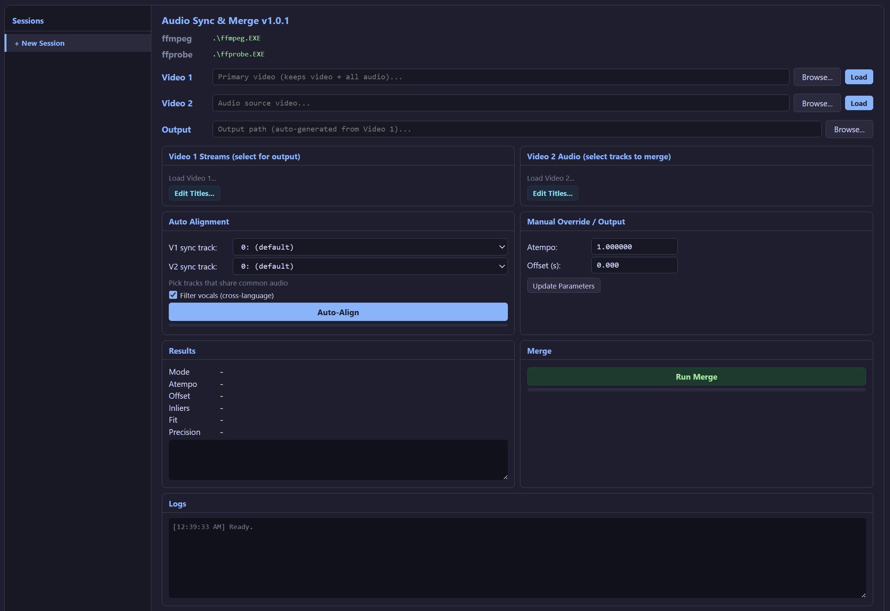

# AudioSync

Audio Sync & Merge — add audio tracks from a secondary video file into a primary video file, automatically syncing them to match timing.

Useful when you have two recordings of the same content (e.g., different camera angles, different language dubs, PAL vs NTSC releases) and want to combine the audio tracks into a single file. AudioSync detects the timing difference between the two recordings using audio fingerprinting, then merges the selected audio tracks with the correct offset and speed adjustment.

## Features

- Auto-alignment via audio fingerprinting, cross-correlation, and RANSAC-based matching
- Cross-language and cross-framerate support (e.g., 24fps Blu-ray + 25fps PAL DVD)
- Vocal filter for cross-language matching (band-reject removes speech, keeps music/effects)
- Piecewise alignment for content with breaks (censored scenes, different edits)
- Speed detection across 7 candidates (23.976/25, 24/25, 1.0, 25/24, etc.)
- Manual sync override (atempo and offset)
- Multi-audio track selection and metadata editing
- FFmpeg-based merge
- Cross-platform: Windows, Linux, macOS, Docker

## How It Works

### Alignment Algorithm

AudioSync uses a multi-stage pipeline to automatically determine the speed ratio and time offset between two video files:

1. **Audio Decoding** — Full audio is decoded from both files using FFmpeg at 8kHz mono.

2. **Fingerprint Extraction** — Two types of fingerprints are extracted from windowed FFT frames:
   - *Energy-band fingerprints*: Log-energy across 40 frequency bands (used for cross-correlation envelope matching).
   - *Band-peak fingerprints*: Peak spectral magnitudes grouped into 128 coarse bands (used for point-to-point matching).

3. **Cross-Correlation with Speed Search** — Audio is downsampled to ~100Hz envelopes. For each of 7 speed candidates (covering PAL/NTSC/film conversions), V2's envelope is time-stretched and cross-correlated against V1 using FFT. The candidate with the highest correlation peak gives the coarse speed and offset estimate.

4. **Fingerprint Matching** — Band-peak fingerprints are matched using cosine similarity with top-k retrieval, filtered by mutual nearest neighbor consistency, then filtered by the coarse offset/speed estimate.

5. **RANSAC Linear Fit** — A linear model `t1 = a * t2 + b` is fitted to the matched timestamp pairs using RANSAC (3000 iterations). The slope `a` gives the speed ratio, the intercept `b` gives the time offset. The speed is snapped to the nearest known candidate if within 0.5% tolerance.

6. **Quality Fallback** — If RANSAC produces few inliers (<15), high residuals, or poor V1 coverage, the cross-correlation speed/offset is used instead.

7. **Piecewise Segment Detection** — Split cross-correlation on downsampled audio detects content breaks (e.g., censored scenes that shift the offset partway through). Each segment gets its own offset, and the merge produces a piecewise-aligned output using FFmpeg's concat filter.

### Vocal Filter (Cross-Language Mode)

When enabled, a hybrid two-pass approach is used:
- **Pass 1**: Unfiltered audio for fingerprint extraction (better spectral matching).
- **Pass 2**: Band-reject filtered audio (removes 300Hz–3kHz vocal range, keeps bass and treble) for cross-correlation and segment detection (more precise when dialogue differs between languages).

### Merge

FFmpeg builds a complex filtergraph that applies:
- `atempo` for speed adjustment (chained for extreme values)
- `adelay` for positive offsets (embeds silence in audio data)
- `atrim` for negative offsets
- `concat` for piecewise segments with different offsets

Selected V1 streams (video, audio, subtitles) are copied, and selected V2 audio tracks are added with the computed alignment.

## Screenshots



## Usage

1. **Load videos** — Enter paths or use Browse/Upload for Video 1 (primary, keeps video) and Video 2 (audio source).
2. **Select tracks** — Check which V1 streams to keep and which V2 audio tracks to merge.
3. **Auto-Align** — Click Auto-Align to compute the speed ratio and offset. Enable "Filter vocals" for cross-language content.
4. **Review results** — Check the atempo, offset, inlier count, and precision in the Results panel. Adjust manually if needed.
5. **Merge** — Click Run Merge to produce the output file with all selected tracks synchronized.
6. **Sessions** — Use the sidebar to manage multiple sessions. State is preserved across page refreshes.

## Windows Standalone

Download `AudioSync.exe` from the [latest release](https://github.com/dockdv/AudioSync/releases/latest). Place `ffmpeg.exe` and `ffprobe.exe` in the same folder (or ensure they are on PATH), then run `AudioSync.exe` and open http://localhost:5000.

## webGUI

### Requirements

- Python 3.10+
- FFmpeg and FFprobe on PATH (or set `FFMPEG_PATH` / `FFPROBE_PATH` environment variables)

### Linux / macOS

```bash
cd src/webGUI
./start.sh
```

### Windows

```cmd
src\webGUI\start.bat
```

Then open http://localhost:5000.

## Docker

### Build and run

```bash
docker build -t audiosync -f src/contApp/Dockerfile .
docker run -p 5000:5000 -v /path/to/videos:/videos audiosync
```

### Docker Compose

```bash
cd src/contApp
docker compose up --build
```

### Docker Compose (published image)

```yaml
services:
  audiosync:
    image: ghcr.io/dockdv/audiosync:latest
    ports:
      - 5000:5000
    volumes:
      - /path/to/videos:/videos
      # - /usr/local/bin/ffmpeg:/usr/local/bin/ffmpeg:ro
      # - /usr/local/bin/ffprobe:/usr/local/bin/ffprobe:ro
    environment:
      # - FFMPEG_PATH=/usr/local/bin/ffmpeg
      # - FFPROBE_PATH=/usr/local/bin/ffprobe
    restart: unless-stopped
```

Then open http://localhost:5000.

## License

[MIT](LICENSE)
